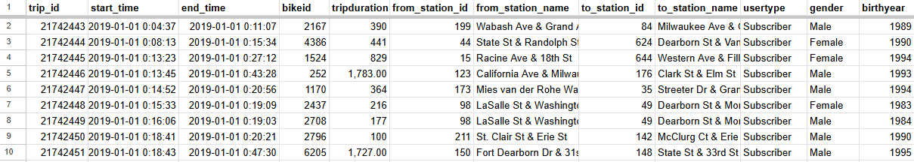
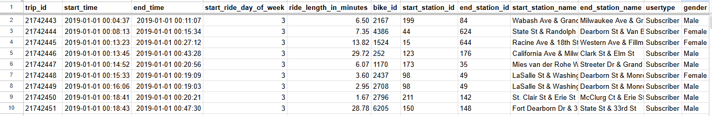

# Cyclistic-Bike-Share-Customer-Conversion-Analysis

## Introduction to Business Task 

- **Company Background and Scenario:** Cyclistic is a Chicago based bike-share service company which offers the following bike pricing plans: single-ride passes, full-day passes and annual memberships. The service features over 5800 bicycles and 600 docking stations, all bike users are required to return bikes to any docking station within 24 hours regardless of the pricing plan selected by a user.

- **Core Objective:** The Director of Marketing, Lily Moreno aims to maximize annual memberships by converting existing casual riders(Users that do not have annual memberships) into annual members. This is because finance analysts concluded that annual members are more profitable than casual riders. The main goal is to analyze how casual riders and annual members use bikes differently, the insights are then used to design marketing strategies that convert casual riders to annual members.

- **A sample of the Historical Bike Trips Data**

This table shows a sample of the raw Chicago Bike Trips data in the first quarter(January, February and March) of 2019. Data Source : The raw data is from Motivate International Inc.

- For additional information about the business scenario read [Cyclistic Case Study ](./documents/Case_Study.pdf)

## Data Cleaning and Preparation
- A preview of the cleaned data set

- **Data Cleaning Steps:**
  
- Dropped `tripduration` column due to unclear time units , it is replaced by a new `ride_length_in_minutes` column which is calculated using        the difference between the `start_time` and `end_time` columns.

