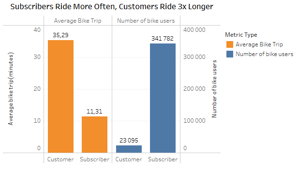
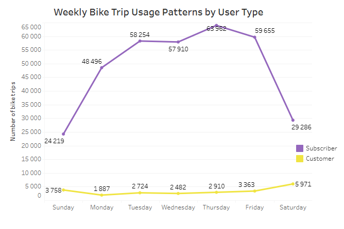
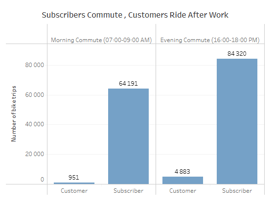
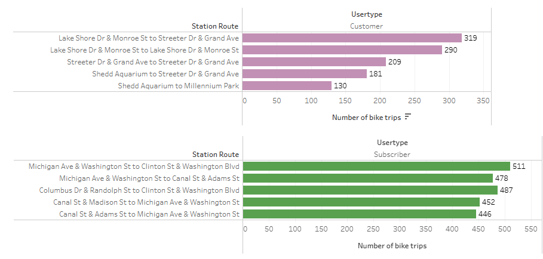

# Cyclistic-Bike-Share-Customer-Conversion-Analysis

## Introduction to Business Task 

- **Company Background and Scenario:** Cyclistic is a Chicago based bike-share service company which offers the following bike pricing plans: single-ride passes, full-day passes and annual memberships. The service features over 5800 bicycles and 600 docking stations, all bike users are required to return bikes to any docking station within 24 hours regardless of the pricing plan selected by a user.

- **Core Objective:** The Director of Marketing, Lily Moreno aims to maximize annual memberships by converting existing casual riders(Users that do not have annual memberships) into annual members. This is because finance analysts concluded that annual members are more profitable than casual riders. The main goal is to analyze how casual riders and annual members use bikes differently, the insights are then used to design marketing strategies that convert casual riders to annual members.

- **A sample of the Historical Bike Trips Data**

This table shows a sample of the raw Chicago Bike Trips data in the first quarter(January, February and March) of 2019. Data Source : The raw data is from Motivate International Inc.

- For additional information about the business scenario read [Cyclistic Case Study ](./documents/Case_Study.pdf)
- The complete raw data set can be accessed here : [Raw Bike trips Data 2019 Q1 ](https://docs.google.com/spreadsheets/d/1AYa1EMxdi2xoXapZ2dC8yKQ2-lzfg43HKzLI5_iwypE/edit?usp=sharing)

## Data Cleaning and Preparation
- A preview of the data set cleaned using **Google Sheets:**

- The complete cleaned data set can be accessed here : [Cleaned Bike Trips Data 2019 Q1 ](https://docs.google.com/spreadsheets/d/13G0EC9-HtpbO_EKQvlPp_RQwc49_ECCZRK2AnAakFDU/edit?usp=sharing)

- **Data Cleaning Steps:**
  
    - Dropped `tripduration` column due to unclear time units , it is replaced by a new `ride_length_in_minutes` column which is calculated using        the difference between the `start_time` and `end_time` columns.
    - Standardized station column names by renaming `from_station_id`, `to_station_id`, `from_station_name`, and `to_station_name` to                    `start_station_id`, `end_station_id`, `start_station_name`, and `end_station_name` respectively.
    - **Handled Missing Values:** Retained rows with missing `gender` and `birthyear` entries, this is because demographic analysis is outside the       primary project scope, and  dropping these rows would unnecessarily reduce sample size and compromise overall data integrity.
    - Removed the special trailing characters (*) that appear at the end of the `start_station_name` and `end_station_name` column entries , this        will make the searching of station names accurate.
    - **Excluded Outliers:** Filtered out 192 trips exceeding the 24-hour maximum usage policy (1,440 minutes), this is because Cyclistic requires       bikes to be returned within 24 hours, these extreme outliers represent stolen or unreturned bikes and fall outside standard bike trip  patterns.

## Data Analysis, Visualizations & Insights

The exploratory data analysis was conducted using **SQL** in **Google BigQuery** to uncover key behavioral differences between Subscribers and Customers. All data visualizations were built using **Tableau**. 

- You can view the full BigQuery SQL script with comments and insights here: [SQL BigQuery Script](./analysis.sql)
---

### 1. Bike Trip Duration & Ride Characteristics

* **Key Takeaways:** 
  * Subscribers account for the majority of total bike trips (341 782 trips) in the overall data set, but have a shorter average trip duration of **11.31 minutes**.
  * Customers represent a lower total number of trips(23 095 trips) in overall data set , but spend significantly longer on each ride, averaging **35.29 minutes**.
* **Marketing Recommendation:** Create a targeted campaign highlighting how much money can be saved by using annual memberships for long-duration rides. Emphasize that switching from pay-per-use passes to annual memberships eliminates extra per-minute charges incurred during extended trips.

---

### 2. Weekly Riding Patterns & Peak Usage Days

* **Key Takeaways:**
  * **Subscriber Activity:** Subscriber bike trips increase sharply from Sunday starting at **24 219 trips** and reaches its maximum on Thursdays (**63 962 trips**).
  * **Customer activity:** Customer bike trips stay relatively low throughout all week days (hovering around 3000 bike trips/day) and shifts upward toward the weekend, peaking on Sunday at **5 971 trips**.
* **Marketing Recommendation:** Launch weekend-focused digital promotions mainly targeted at Customers since Saturday and Sunday are the two days with the highest number of bike trips for them, maintaining high subscriber engagement should not be ignored but for now we only focus on converting customers to annual members(subscribers). 

---

### 3. Commute Hours vs. Recreational Usage

* **Key Takeaways:**
  * Subscribers heavily utilize bikes during standard commuting windows (**64,191 morning trips** and **84,320 evening trips**), confirming their primary use case is daily transit.
  * Customers rarely ride during the morning commute (**951 trips**), but their usage increases fivefold during the evening commute window (**4,883 trips**).
* **Marketing Recommendation:** Frame the annual membership around daily commuting convenience, reliability, and cost efficiency compared to public transit or ride-shares. Target evening casual riders with messaging focused on using Cyclistic for after-work transit and leisure.

---

### 4. Station Routes & Geographical Usage

               **Top 5 Most Used Station Routes Per Usertype**
  

* **Key Takeaways:**
  * Top route volumes for both groups range from **130 to 511 trips**, demonstrating that rides are widely distributed across the network rather than concentrated on a few corridor lines.
  * Customers utilize completely distinct routes compared to Subscribers, leaning heavily toward recreational areas, waterfronts, and parks.
* **Marketing Recommendation:** Place physical marketing signage, QR codes for instant membership sign-ups, or promotional events directly at top Customer origin and destination stations near key recreational hotspots.

